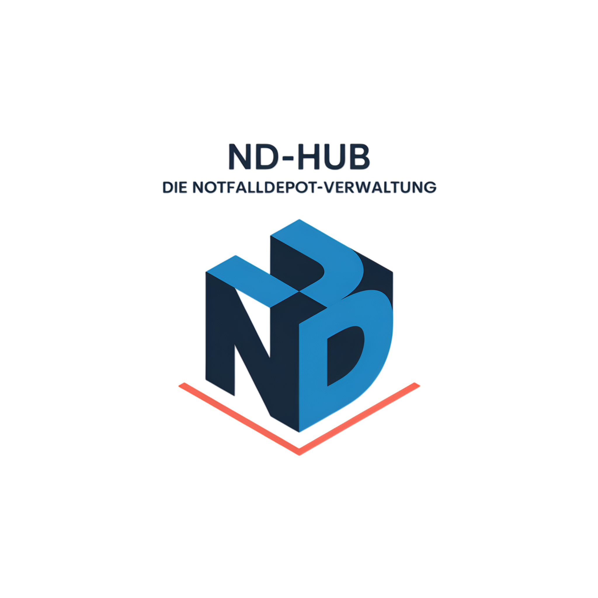

# ND-Hub

<p align="center">
  
</p>

<p align="center">
  
  
  
  <a href="https://github.com/QuasiniusQuaks/nd-hub/pkgs/container/nd-hub"></a>
</p>

<p align="center">
  <strong>Digitale Plattform zur strukturierten Verwaltung von Notfalldepots</strong><br/>
  Desktop-Client und Webanwendung fuer sichere Prozesse, hohe Transparenz und belastbare Auswertungen.
</p>

---

## Inhaltsverzeichnis

- [Enterprise-Dokumentation](#enterprise-dokumentation)
- [Was ist ND-Hub?](#was-ist-nd-hub)
- [Produktstatus (aktuell)](#produktstatus-aktuell)
- [Die zwei Software-Produkte im Ueberblick](#die-zwei-software-produkte-im-ueberblick)
- [Feature-Highlights auf einen Blick](#feature-highlights-auf-einen-blick)
- [Zielgruppen und Einsatzszenarien](#zielgruppen-und-einsatzszenarien)
- [Warum ND-Hub fuer potenzielle Kunden relevant ist](#warum-nd-hub-fuer-potenzielle-kunden-relevant-ist)
- [Kurzvergleich Desktop vs. Web](#kurzvergleich-desktop-vs-web)
- [Architektur auf einen Blick](#architektur-auf-einen-blick)
- [Docker Deployment (ndhub-web)](#docker-deployment-ndhub-web)
- [Schnellstart](#schnellstart)
- [Wichtige Projektpfade](#wichtige-projektpfade)
- [FAQ fuer Interessenten](#faq-fuer-interessenten)
- [Warum jetzt starten?](#warum-jetzt-starten)
- [Kontakt & Demo](#kontakt--demo)
- [Historie](#historie)

---

## Enterprise-Dokumentation

Die vollstaendige, konsolidierte Dokumentation von ND-Hub
(Architektur, Desktop, Web, Deployment, Operations, Security,
API-Referenz, Migration, Sync, Quality, Roadmap, Glossar) liegt unter
[`docs/`](docs/index.md) und ist als MkDocs-Material-Site lokal lauffaehig:

```bash
pip install mkdocs-material
mkdocs serve
```

Diese README hier dient als kompakter **Produktueberblick fuer
Interessenten und Entscheider**. Fuer den technischen und operativen
Stand bitte direkt die Doku-Site nutzen.

---

## Was ist ND-Hub?

ND-Hub ist eine spezialisierte Softwareloesung fuer Organisationen, die Notfalldepots, Praeparate, Bewegungen und Verfallsdaten professionell steuern wollen.  
Das Repository umfasst zwei Produktlinien mit demselben fachlichen Kern:

- `desktop-client/`: lokale, performante Desktopanwendung mit moderner UI und integriertem Backend.
- `ndhub-web/`: webbasierte Variante mit FastAPI-Backend, React-Frontend, Docker-Betrieb und unterstuetztem SQLite-/MariaDB-Betrieb.

Beide Loesungen verfolgen dasselbe Ziel: **betriebliche Sicherheit erhoehen, manuelle Aufwaende reduzieren und revisionsfaehige Daten schaffen**.

### Produktstatus (aktuell)

- **Aktuelle Version (Dokumentation / Desktop-Linie):** `v0.5`
- **ndhub-web (FastAPI + npm-Package):** `0.1.1`
- **Bereitstellungsmodelle:** Desktop (lokal) und Web (zentral/containerfaehig)
- **Schwerpunkt:** Stabiler operativer Betrieb, Sicherheit und fachliche Nachvollziehbarkeit

---

## Die zwei Software-Produkte im Ueberblick

### 1) ND-Hub Desktop Client

Die Desktopanwendung (PySide6) richtet sich an Teams, die ein robustes, lokales Arbeitswerkzeug mit hoher Reaktionsgeschwindigkeit und geringer Betriebsabhaengigkeit benoetigen.

**Ideal fuer Kunden, die ...**

- sensible Prozesse bevorzugt lokal betreiben moechten.
- eine performante App fuer den taeglichen Arbeitsplatz brauchen.
- klare, gefuehrte Oberflaechen fuer operative Teams erwarten.

**Kernnutzen**

- Schnelles, direktes Arbeiten am Arbeitsplatz ohne Browser-Abhaengigkeit.
- Durchgaengige Bedienfuehrung fuer operative Prozesse rund um Notfalldepots.
- Lokaler Betrieb mit klarer Trennung von Programm- und Datenpfaden.

**Wichtige Funktionsbereiche**

- Dashboard fuer Bestands- und Uebersichtskennzahlen.
- Depotverwaltung (Anlegen, Bearbeiten, Strukturieren).
- Praeparateverwaltung inkl. Zuordnungen und Sollbestaenden.
- Bewegungsmanagement (Ein- und Ausgaenge) inklusive Dokumentenbezug.
- Verfallmanagement mit Fristenfokus und Fruehwarnlogik.
- E-Mail-Funktionen mit Empfaenger-Vorschau und Verlauf.
- Berichte und Exporte (CSV/PDF/PPTX) fuer Fachbereich und Management.
- **Analytics Control Center** (v0.5): interaktives Kontrollzentrum mit
  Insight-Banner, Auto-Insights, 6-Tab-Cluster (Bestand, Bewegungen, Verfall,
  Compliance, Custom-SQL, Email-Schedule), Hover-Tooltips, Cross-Filter,
  Saved Views, HTML/PDF-Export und Anomalie-Detection.
- Audit-Logs fuer Nachvollziehbarkeit relevanter Aktionen.
- Backup/Restore-Funktionen fuer Datensicherung und Wiederherstellung.
- Setup-Wizard fuer strukturierte Erstkonfiguration.
- Benutzer- und Rechteverwaltung mit Admin-Schutzmechanismen.

**Technische und betriebliche Staerken**

- Sicherheitsarchitektur mit Passwort-Hashing, Account-Schutz und Rollenlogik.
- Globales Error-Handling fuer stabilen Betrieb im Alltag.
- Datenbankoptimierung (SQLite/WAL) fuer performante Zugriffe.
- Geeignet fuer Umgebungen mit restriktiven Berechtigungen.

Mehr Details: [`desktop-client/README.md`](desktop-client/README.md)

---

### 2) ND-Hub Webanwendung

Die Webanwendung ist fuer Organisationen gedacht, die zentrale Bereitstellung, browserbasierten Zugriff und eine skalierbare Datenstrategie (SQLite oder MariaDB) priorisieren.

**Ideal fuer Kunden, die ...**

- standortuebergreifend ueber den Browser arbeiten moechten.
- eine zentrale Betriebsplattform mit API-Fokus suchen.
- ihre Infrastruktur schrittweise modernisieren wollen.

**Kernnutzen**

- Zentraler Zugriff ueber Browser statt lokaler Installation pro Arbeitsplatz.
- API-zentrierter Aufbau fuer Integrationen und saubere Systemgrenzen.
- Containerfaehiger Betrieb via Docker Compose.

**Wichtige Funktionsbereiche**

- Authentifizierung und rollenbasierte Zugriffssteuerung.
- Vollstaendige CRUD-Prozesse fuer Depots, Praeparate und Kontakte.
- Bewegungsverwaltung mit Filterung, Pagination und PDF-Anhangsfunktion.
- Importstrecke fuer CSV/Excel inkl. Vorschau, Validierung und idempotenter Ausfuehrung.
- E-Mail-Workflows als Entwurf oder SMTP-Versand mit Statusverfolgung.
- Umfassende Reportings (Bestand, Bewegungen, Ranking, Matrix, Verfall) inkl. Export.
- Verfallsuebersichten und Benachrichtigungsendpunkte.
- Audit-Log-Endpunkte fuer Compliance- und Pruefkontexte.
- Admin-Backup/Restore mit Schutz gegen unkontrollierte Upload-Groessen.

**Technische und betriebliche Staerken**

- FastAPI-Backend mit klar dokumentierten Endpunkten.
- React/Vite-Frontend als moderne UI-Basis (inkrementeller Ausbau).
- Docker- und Migrationsartefakte fuer standardisierten Betrieb.
- Betriebsfaehig mit `ND_HUB_DB_ENGINE=sqlite` oder `ND_HUB_DB_ENGINE=mariadb`.
- Docker-Compose-Stack mit integrierter MariaDB und umschaltbarer DB-Engine per Environment.
- Kontrollierter Cutover-/Rollback-Pfad inkl. Smoke- und Go-Live-Checklisten.
- Hybrid-Sync- und Stabilitaetstests fuer belastbare Releases.

Mehr Details: [`ndhub-web/backend/README.md`](ndhub-web/backend/README.md)

---

## Feature-Highlights auf einen Blick

### Operative Prozesse

- Strukturierte Verwaltung von Depots, Praeparaten, Kontakten und Bewegungen.
- Verfallmanagement mit Fruehwarnfokus fuer kritische Bestandspositionen.
- Rollenbasierte Arbeitsablaeufe fuer Admins und Fachanwender.

### Analyse, Reporting und Kommunikation

- Fach- und Managementauswertungen fuer Bestand, Bewegungen, Rankings, Matrix und Verfall.
- Exporte in `CSV`, `PDF` und `PPTX` fuer Meetings, Revision und Weiterverarbeitung.
- E-Mail-Workflows inkl. Entwurfsmodus, SMTP-Option und Versandstatushistorie.

### Sicherheit und Compliance

- Auditierbare Prozesse durch rollenbasierte Rechte und Audit-Logs.
- Gehaertete Admin-Funktionen (z. B. Schutz des letzten aktiven Admins).
- Datensicherung durch Backup/Restore-Pfade mit Validierungsmechanismen.

---

## Zielgruppen und Einsatzszenarien

ND-Hub ist besonders interessant fuer:

- Apotheken und krankenhausnahe Versorgungsbereiche mit Notfalldepotverantwortung.
- Leitung und Fachadministration, die Bestands-, Verfalls- und Bewegungsdaten zentral steuern wollen.
- Qualitaetsmanagement, Revision oder Compliance-Funktionen mit Bedarf an auditierbaren Prozessen.
- IT- und Digitalisierungsverantwortliche, die zwischen lokalem und webzentralem Betriebsmodell waehlen moechten.

**Typische Szenarien**

- Standardisierte Pflege von Depotstammdaten und Zuordnungen.
- Regelmaessige Verfallskontrolle mit vorbereiteten Auswertungen.
- Monats-/Quartalsreporting fuer interne Steuerung oder externe Nachweise.
- Datenmigration bzw. schrittweise Modernisierung von lokal zu zentral.

### Entscheider-Mehrwert (fuer potenzielle Kunden)

- **Kostenkontrolle:** weniger manuelle Listenprozesse, weniger Medienbrueche, klare Standards.
- **Risikoreduktion:** transparente Verfalls- und Bewegungsdaten statt verstreuter Einzeldateien.
- **Skalierbarkeit:** Einstieg lokal (Desktop) und Ausbau auf zentrale Webprozesse moeglich.
- **Revisionssicherheit:** dokumentierte Aktionen und exportierbare Nachweise fuer Pruefungen.

---

## Warum ND-Hub fuer potenzielle Kunden relevant ist

- **Transparenz:** alle Kernprozesse sind auswertbar, exportierbar und nachvollziehbar.
- **Sicherheit:** rollenbasierter Zugriff, gehaertete Admin-Funktionen und Auditierbarkeit.
- **Betriebssicherheit:** Backup/Restore, stabile Fehlerbehandlung, pruefbare Releases.
- **Flexibilitaet:** Desktop fuer lokale Teams, Web fuer zentrale Bereitstellung.
- **Zukunftsfaehigkeit:** klarer Entwicklungspfad mit API- und Datenbankstrategie.

---

## Kurzvergleich Desktop vs. Web

| Kriterium | Desktop Client | Webanwendung |
|---|---|---|
| Primarer Einsatz | Lokaler Arbeitsplatzbetrieb | Zentraler Browserzugriff |
| Betriebsmodell | Lokal installiert | Server-/Containerbasiert |
| Staerken | Direktes UI-Feeling, geringe Abhaengigkeit | Zentrale Bereitstellung, API-zentriert |
| Zielbild | Fokus auf operative Einzelstandorte | Fokus auf uebergreifende Verfuegbarkeit |
| Datenstrategie | SQLite (optimiert) | SQLite oder MariaDB (umschaltbar ueber `ND_HUB_DB_ENGINE`) |

---

## Architektur auf einen Blick

```text
ND-Hub Plattform
├── Desktop Client (PySide6 + integriertes FastAPI-Modul)
│   ├── Operative Fachprozesse (Depots, Praeparate, Bewegungen, Verfall)
│   ├── Reporting & Exporte
│   ├── Security / Audit / Backup
│   ├── Core-Module (core/) — zentrale, wiederverwendbare Bausteine
│   │   ├── sync_worker.py     — UI-Thread-entkoppelter Background-Sync (QRunnable)
│   │   ├── secure_token_store.py — sichere Token-Persistenz (keyring + Fernet-Fallback)
│   │   ├── error_handler.py   — einheitliche Fehlerbehandlung
│   │   ├── exception_decorators.py — swallow_exceptions-Decorator-Familie
│   │   └── cache_helpers.py   — TTL-Cache-Wrapper (cachetools) für Instanzmethoden
│   └── Lokale Datenhaltung (SQLite, optimiert)
└── Webanwendung (FastAPI + React/Vite)
    ├── API-zentrierte Fachlogik
    ├── Browser-UI (inkrementelle Islands-Strategie)
    ├── Containerbetrieb (Docker)
    └── Datenpfad SQLite <-> MariaDB (Cutover/Go-Live dokumentiert)
```

---

## Architektur-Audit & Code-Qualität (2026-06)

Das Repository wird regelmäßig einem systematischen Architektur-Audit unterzogen.
Befunde, Fixes und Diskussionen sind direkt auf GitHub dokumentiert.

### Audit-Ergebnisse

| Audit | Issues gesamt | P0 | P1 | P2 | Roadmap |
|---|---|---|---|---|---|
| [2026-06](docs/ARCHITEKTUR_AUDIT_ROADMAP.md) | 15 | 4 | 6 | 5 | ✅ abgeschlossen |

### Wichtigste Fixes aus dem Audit 2026-06

- **Security-Härtung** ([#1](https://github.com/QuasiniusQuaks/nd-hub/pull/1)) — SQL-Parametrisierung, SSRF-Validierung, Secret-Handling, Bandit-Konfig, Smoke-Tests
- **Token-Speicherung** ([#21](https://github.com/QuasiniusQuaks/nd-hub/pull/21)) — keyring mit Fernet-Fallback statt Klartext
- **Heatmap-O(1)-Lookups** ([#20](https://github.com/QuasiniusQuaks/nd-hub/pull/20)) — Performance-Optimierung der Auswertungs-Matrix
- **UI-Thread-Entkopplung** ([#22](https://github.com/QuasiniusQuaks/nd-hub/pull/22)) — QThreadPool statt blockierender Sync
- **Passwort-Timing-Hardening** ([#24](https://github.com/QuasiniusQuaks/nd-hub/pull/24)) — `hmac.compare_digest`, konstante Laufzeit
- **Schema-Fallback-Sicherheit** ([#24](https://github.com/QuasiniusQuaks/nd-hub/pull/24)) — keine hartcodierten Spaltennamen bei Schema-Erkennung
- **Quick-Wins-Bundle** ([#23](https://github.com/QuasiniusQuaks/nd-hub/pull/23)) — 93 ungenutzte Imports, tote Cache-Felder, Logging-Fallback
- **Architektur-Refactor** ([#25](https://github.com/QuasiniusQuaks/nd-hub/pull/25)) — lru_cache-Doku, Exception-Decorator-Modul, TTL-Cache-Helper

### Audit-Follow-up 2026-07

Nach dem Abschluss des 2026-06-Audits wurden weitere P0/P1-Befunde systematisch behoben:

- **Login Rate-Limit / Lockout** ([#48](https://github.com/QuasiniusQuaks/nd-hub/pull/48)) — `slowapi`-basiertes per-IP-Rate-Limit und per-Username-Lockout nach konfigurierbaren Fehlversuchen inkl. `Retry-After`-Header und Audit-Log
- **Auth-Worker fuer Desktop-Login** ([#47](https://github.com/QuasiniusQuaks/nd-hub/pull/47)) — PBKDF2-Passwortpruefung aus dem UI-Thread in einen `QThreadPool`-Worker ausgelagert
- **P1-Sammel-Cleanup** ([#46](https://github.com/QuasiniusQuaks/nd-hub/pull/46)) — `DB`-Konstanten auf `StrEnum`, `@lru_cache` auf `cachetools.TTLCache`, typisierte `except`-Klauseln, explizite `pydantic`-Abhaengigkeit

### Lokale Entwicklung

```bash
# Linting
ruff check desktop-client/ --select F401        # ungenutzte Imports
bandit -r desktop-client/ -c desktop-client/.bandit.yml   # Security

# Tests
pytest desktop-client/tests/unit/ -v
```

### Issue-Workflow

Befunde, Bug-Reports und Architektur-Reviews werden direkt auf GitHub
gepflegt. Format-Vorlage siehe [docs/PULL_REQUEST_TEMPLATE.md](docs/PULL_REQUEST_TEMPLATE.md).

---

## Docker Deployment (ndhub-web)

Dieser Abschnitt beschreibt den **tatsaechlichen aktuellen Deployment-Stand** der Webanwendung mit Docker.

### 1) Technischer Ist-Stand

- Deployment erfolgt ueber `ndhub-web/docker-compose.yml`.
- Der Stack besteht aus:
  - `ndhub-web` (FastAPI + statische Webassets auf Port `8000`)
  - `mariadb` (MariaDB 11.4 auf Port `3306`)
- Die Datenbank-Engine im Backend wird ueber `ND_HUB_DB_ENGINE` gesteuert (`mariadb` oder `sqlite`).
- Im Compose-Setup ist `ND_HUB_DB_ENGINE` standardmaessig auf `mariadb` gesetzt.
- Persistenz wird ueber Docker-Volumes umgesetzt (`ndhub_data`, `ndhub_uploads`, `ndhub_backups`, `ndhub_mariadb_data`).

### 1a) Vorgefertigtes Web-Image (GHCR / optional Docker Hub)

Bei jedem Push auf `main` und bei Git-Tags `v*` baut GitHub Actions das Image aus `ndhub-web/Dockerfile` und veroeffentlicht es unter **GitHub Container Registry** (Paket ist mit diesem Repository verknuepft):

- Paketuebersicht: [github.com/QuasiniusQuaks/nd-hub/pkgs/container/nd-hub](https://github.com/QuasiniusQuaks/nd-hub/pkgs/container/nd-hub)
- Pull (Beispiel `latest`): `docker pull ghcr.io/quasiniusquaks/nd-hub:latest`

**Compose mit Registry-Image:** In `ndhub-web/.env` die Variable aus `.env.example` setzen, z. B. `NDHUB_WEB_IMAGE=ghcr.io/quasiniusquaks/nd-hub:latest`, dann:

```bash
cd ndhub-web
docker compose pull ndhub-web
docker compose up -d --no-build
```

Ohne `NDHUB_WEB_IMAGE` wird wie bisher lokal gebaut (`docker compose up -d --build`).

**Optional Docker Hub:** Repository-Variable `DOCKERHUB_PUSH` auf `true` setzen und die Secrets `DOCKERHUB_USERNAME` sowie `DOCKERHUB_TOKEN` in den Repository-Action-Secrets anlegen. Derselbe Workflow spiegelt das Image zusaetzlich nach `docker.io/spypanther/ndhub-web` (Tags entsprechen GHCR). Hub-Repository-Name bei Bedarf im Workflow anpassen.

### 2) Voraussetzungen

- Docker Engine + Docker Compose Plugin installiert.
- Port `8000` (Web/API) und bei externer DB-Nutzung optional `3306` verfuegbar.
- Fuer produktionsnahen Einsatz: gepflegte `.env`-Datei mit sicheren Secrets.

### 3) Konfiguration vorbereiten

```bash
cd ndhub-web
cp .env.example .env
```

Wichtige Variablen in `.env`:

- **Sicherheit/Initialbetrieb**
  - `ND_HUB_INITIAL_ADMIN_PASSWORD`
  - `ND_HUB_FORCE_ADMIN_PASSWORD_SYNC` (nur gezielt/temporar verwenden)
- **DB-Engine**
  - `ND_HUB_DB_ENGINE=sqlite|mariadb`
  - `ND_HUB_DUAL_WRITE_SQLITE=0|1` (Uebergangsmodus fuer kontrollierte Cutover-Phasen)
- **MariaDB**
  - `ND_HUB_MARIADB_HOST`, `ND_HUB_MARIADB_PORT`
  - `ND_HUB_MARIADB_DATABASE`, `ND_HUB_MARIADB_USER`, `ND_HUB_MARIADB_PASSWORD`
  - `ND_HUB_MARIADB_ROOT_PASSWORD`
- **Backups/Dateien**
  - `ND_HUB_AUTO_BACKUP_HOURS`
  - `ND_HUB_MAX_BACKUP_RESTORE_MB`
  - `ND_HUB_ATTACHMENTS_DIR`, `ND_HUB_BACKUPS_DIR`
- **E-Mail (optional live)**
  - `ND_HUB_EMAIL_DELIVERY_MODE=draft|smtp`
  - `ND_HUB_SMTP_*`
- **Compose / Registry-Image (optional)**
  - `NDHUB_WEB_IMAGE` (siehe Abschnitt 1a)

### 4) Deployment starten

```bash
cd ndhub-web
docker compose up -d --build
```

Danach verfuegbar:

- App/API: `http://localhost:8000`
- Health: `http://localhost:8000/health`

### 5) Betriebsmodi: MariaDB vs. SQLite

**MariaDB-Modus (empfohlen fuer staging/production-nahe Umgebungen)**

- `.env`: `ND_HUB_DB_ENGINE=mariadb`
- Compose startet `mariadb` automatisch mit.
- In produktionsnahen Umgebungen ist dieser Modus das Zielbild.

**SQLite-Modus (lokal/schneller Testbetrieb)**

- `.env`: `ND_HUB_DB_ENGINE=sqlite`
- Das Backend arbeitet dann gegen `ND_HUB_DB_PATH` (standardmaessig unter `/data`).
- Der Compose-Stack beinhaltet weiterhin den MariaDB-Service; fachlich nutzt die App aber SQLite.

### 6) Healthchecks und Verifikation

```bash
cd ndhub-web
docker compose ps
docker compose logs -f ndhub-web
```

Minimalpruefung:

- `GET /health` liefert HTTP `200`.
- Login erfolgreich.
- Kernflows (z. B. Bewegungen, Reports, Backup-Liste) ohne Fehler.

### 7) Update- und Restart-Operationen

**Lokaler Build (Standard):**

```bash
cd ndhub-web
docker compose pull
docker compose up -d --build
docker compose restart ndhub-web
```

`docker compose pull` aktualisiert dabei vor allem das MariaDB-Basisimage; der `ndhub-web`-Service wird ueber `--build` neu erzeugt, sofern kein `NDHUB_WEB_IMAGE` gesetzt ist.

**Vorgefertigtes Web-Image (`NDHUB_WEB_IMAGE` gesetzt):**

```bash
cd ndhub-web
docker compose pull ndhub-web
docker compose up -d --no-build
docker compose restart ndhub-web
```

Hinweis: Bei Aenderungen an `.env` oder Abhaengigkeiten den Stack neu erzeugen (`up -d --build` bzw. nach Registry-Update erneut `pull` + `up -d --no-build`).

### 8) Backup, Restore und Betriebssicherheit

- Persistente Daten liegen in Volumes (DB, Uploads, Backups).
- Backup/Restore-Endpunkte sind gehaertet (Format-/Groessenpruefung).
- Fuer MariaDB-Cutover und produktive Freigabe gilt der konsolidierte Pfad:
  - [`docs/migration-and-sync/02-mariadb-cutover.md`](docs/migration-and-sync/02-mariadb-cutover.md)
  - Originaldokumente sind unter [`docs/legacy/ndhub-web/`](docs/legacy/index.md) archiviert.

### 9) Produktionsnahe Mindest-Checkliste

- Starke Passwoerter/Secrets in `.env` gesetzt.
- `ND_HUB_DB_ENGINE=mariadb` fuer zentrale Umgebung aktiv.
- `ND_HUB_DUAL_WRITE_SQLITE=0` ausserhalb kontrollierter Uebergangsfenster.
- Healthchecks gruen, Kern-Smoketests bestanden.
- Backup-Restore-Test einmal in Zielumgebung validiert.
- E-Mail-Betrieb bewusst dokumentiert (`draft` oder `smtp`).

---

## Schnellstart

### Desktop Client starten

```bash
cd desktop-client
python -m venv .venv && . .venv/bin/activate
pip install -r requirements.txt
python run_notfalldepots.py
```

### Webanwendung lokal starten

```bash
cd ndhub-web/frontend-react && npm install && npm run build
cd ../.. && cd ndhub-web && python -m venv .venv && . .venv/bin/activate
pip install -r requirements.txt
python run_backend.py
```

---

## Wichtige Projektpfade

- `desktop-client/` - Desktopprodukt inkl. UI, Kernlogik und lokaler Betriebswerkzeuge
- `ndhub-web/` - Webprodukt inkl. Backend, Frontend und Docker-/Migrationspfaden
- `desktop-client/tests/` - Unit-, Integrations- und Performancetests
- `ndhub-web/backend/tests/` - API-, Security-, Stabilitaets- und Sync-Tests

---

## FAQ fuer Interessenten

### Ist ND-Hub eher fuer kleine Teams oder fuer groeßere Organisationen geeignet?

Beides ist moeglich: Der Desktop-Client ist stark fuer lokal arbeitende Teams, die Webanwendung fuer zentral organisierte, standortuebergreifende Strukturen.

### Kann man mit dem Desktop starten und spaeter auf Web erweitern?

Ja. Das Produkt ist so aufgebaut, dass ein schrittweiser Ausbau vom lokalen Betrieb hin zu zentralen Webprozessen moeglich ist.

### Welche Datenbankstrategie verfolgt ND-Hub?

Die Webanwendung unterstuetzt SQLite und MariaDB. Fuer den produktiven MariaDB-Betrieb sind Cutover-, Smoke- und Rollback-Prozesse dokumentiert; optional steht ein kurzer Dual-Write-Uebergangsmodus zur Verfuegung.

### Wie unterstuetzt ND-Hub Compliance und Pruefbarkeit?

Durch rollenbasierte Zugriffe, Audit-Logs, nachvollziehbare Fachprozesse und exportierbare Auswertungen fuer interne wie externe Pruefkontexte.

### Welche Export- und Berichtsoptionen sind verfuegbar?

Berichte koennen je nach Bereich als `CSV`, `PDF` und `PPTX` exportiert werden, z. B. fuer Management-Updates, Audits und operative Auswertungen.

---

## Warum jetzt starten?

- **Schnelle Wirkung im Alltag:** Standardisierte Prozesse reduzieren Suchaufwand, Rueckfragen und Medienbrueche bereits in der Einfuehrungsphase.
- **Bessere Steuerbarkeit:** Verfalls-, Bestands- und Bewegungsdaten werden zentral sichtbar und sind fuer Entscheidungen sofort nutzbar.
- **Geringeres Betriebsrisiko:** Rollen, Audit-Logs und Backup/Restore schaffen Verlaesslichkeit in kritischen Versorgungsprozessen.
- **Schrittweise Modernisierung statt Big Bang:** Start mit Desktop oder Web moeglich, anschliessend planbarer Ausbau entlang Ihrer Infrastrukturstrategie.

---

## Kontakt & Demo

Sie moechten ND-Hub fuer Ihre Organisation bewerten?  
Gern unterstuetzen wir mit einem strukturierten Demo- und Einfuehrungsprozess.

### Empfohlener Ablauf fuer Interessenten

1. **Kurz-Assessment (30 Min.)**  
   Gemeinsame Sicht auf aktuelle Prozesse, Anforderungen und Zielbild.
2. **Produktdemo (45-60 Min.)**  
   Live-Einblick in Desktop-Client und Webanwendung entlang realer Anwendungsfaelle.
3. **Pilotplanung**  
   Definition von Pilotumfang, Rollen, Datenbasis und Erfolgskriterien.
4. **Onboarding & Go-Live**  
   Technische Einrichtung, Schulung der Kernanwender und operative Inbetriebnahme.

### Was fuer eine Demo hilfreich ist

- Anzahl der Standorte / beteiligten Teams
- heutiger Prozess fuer Bestands- und Verfallskontrolle
- benoetigte Berichte / Exportformate
- gewuenschtes Betriebsmodell (Desktop, Web oder Hybrid)

> Hinweis: Diese README dient als Produktueberblick.  
> Fuer technische Details und Betriebsdokumentation siehe die
> [Enterprise-Dokumentation unter `docs/`](docs/index.md) sowie die
> projektspezifischen READMEs in `desktop-client/` und `ndhub-web/`.

---

## Historie

Dieses Repository wurde mit einer orphan-Wurzel neu aufgesetzt und auf die beiden aktuellen Hauptlinien fokussiert (`desktop-client` und `ndhub-web`).  
Aeltere Versionsordner (z. B. V1-V39) liegen nur noch in Archiv-Branches bzw. externen Backups.
