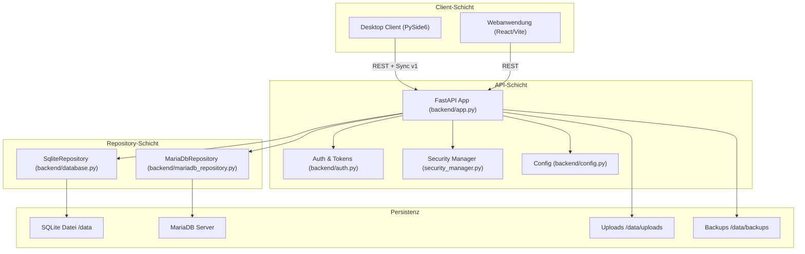
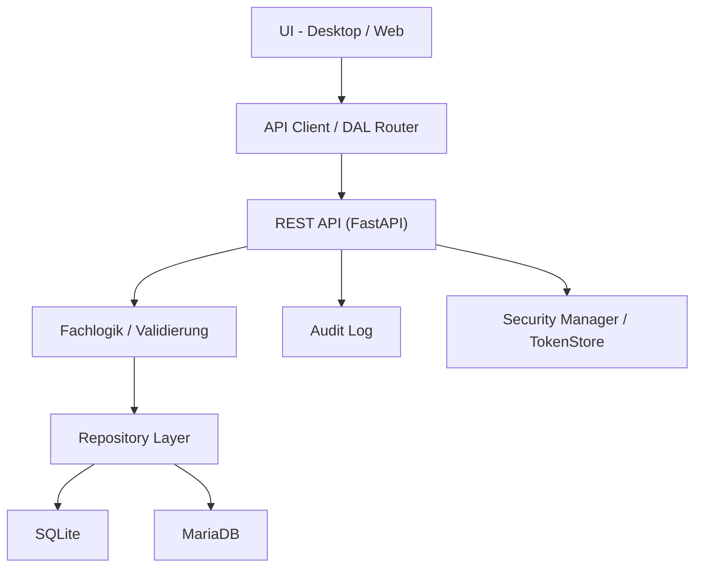

# Systemarchitektur

## Architekturprinzipien

ND-Hub folgt einigen klaren Leitplanken, die im gesamten Stack durchgehalten werden:

- **Server-first, modulare Clients**: Fachlogik liegt im Backend; Desktop und Web
  konsumieren dieselben Regeln ueber API-Schnittstellen.
- **API-Vertrag stabil halten**: SQLite oder MariaDB sind austauschbare Storage-
  Implementierungen; die API aendert sich dadurch nicht.
- **Auditierbarkeit by Default**: Aenderungen an Stammdaten werden ueber
  `api_audit_log` erfasst.
- **Idempotenz und Wiederaufnahme**: Sync- und Import-Strecken arbeiten
  fingerprint-/batch-basiert.
- **Konfigurations- vs. Datenpfad-Trennung**: insbesondere im Desktop Client
  sind `APPDATA`/Config-Pfade strikt von Programmdateien getrennt.

## High-Level System

## Komponenten im Detail

### Desktop Client (`desktop-client/`)

| Modul | Zweck |
|---|---|
| `nd_hub.py` | Haupteinstiegspunkt und Orchestrator. |
| `core/config_manager.py` | Pfad- und Einstellungsmanagement (APPDATA/Linux Home). |
| `core/error_handler.py` | Globaler Exception-Hook und Fehler-Dialoge. |
| `core/data_access_layer.py` | Router lokal vs. remote (Hybrid-Modus). |
| `core/sync_service.py` | Push-/Pull-Mechanik gegen das Web-Backend. |
| `db_manager.py` | SQLite-Abstraktion fuer Desktop. |
| `security_manager.py` | bcrypt, Account-Sperre, Passwortregeln. |
| `ui/pages/*` | Modulare UI-Seiten (Bewegungen, Historie, Auswertungen, etc.). |
| `ui/dialogs/*` | Modale Dialoge (Login, Setup-Wizard, Detailansichten). |
| `backend/app.py` | Eingebettetes FastAPI-Modul fuer lokale Web-Hilfen. |

### Webanwendung (`ndhub-web/`)

| Modul | Zweck |
|---|---|
| `backend/app.py` | FastAPI-App, alle REST-Endpunkte und Lifecycle. |
| `backend/auth.py` | Token-Store und Authentifizierung. |
| `backend/database.py` | `SqliteRepository`, Schemaverwaltung. |
| `backend/mariadb_repository.py` | MariaDB-Pfad mit optionalem Dual-Write. |
| `backend/config.py` | Resolver fuer Engines, Pfade und SMTP. |
| `backend/tools/migrate_sqlite_to_mariadb.py` | Migrationsskript SQLite -> MariaDB. |
| `backend/web/*` | Statische Web-MVP-Assets (Fallback-Frontend). |
| `frontend-react/` | Vite/React-Frontend (Islands-Strategie). |
| `Dockerfile`, `docker-compose.yml` | Deployment-Stack. |

### Externe Abhaengigkeiten

- **MariaDB 11.4** als zentrale Datenbank in produktionsnahen Umgebungen.
- **SMTP-Server** (optional) fuer Liveversand von E-Mails.
- **Reverse Proxy / TLS-Terminator** in produktiven Deployments empfohlen
  (siehe [Operations / Runbooks](../operations/01-runbooks.md)).

## Schichtenmodell

## Konfigurations- und Datenpfade

| Komponente | Programmpfad | Daten-/Konfigpfad |
|---|---|---|
| Desktop Windows | App-Verzeichnis | `%APPDATA%/ND-Hub/` |
| Desktop Linux | App-Verzeichnis | `~/.ND-Hub/` |
| Web Container | `/app` | `/data` (DB, Uploads, Backups als Volumes) |

## Designprinzipien fuer Erweiterungen

- Neue API-Endpunkte folgen den vorhandenen Konventionen (Auth, Audit, Pagination).
- Neue Reports werden ueber dieselbe `report/<name>` Routenfamilie eingefuegt.
- Repository-Erweiterungen werden zuerst im SqliteRepository umgesetzt und
  anschliessend MariaDB-konform gespiegelt (siehe
  [Migration & Sync](../migration-and-sync/01-sqlite-vs-mariadb.md)).
