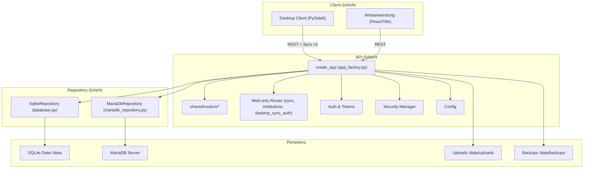
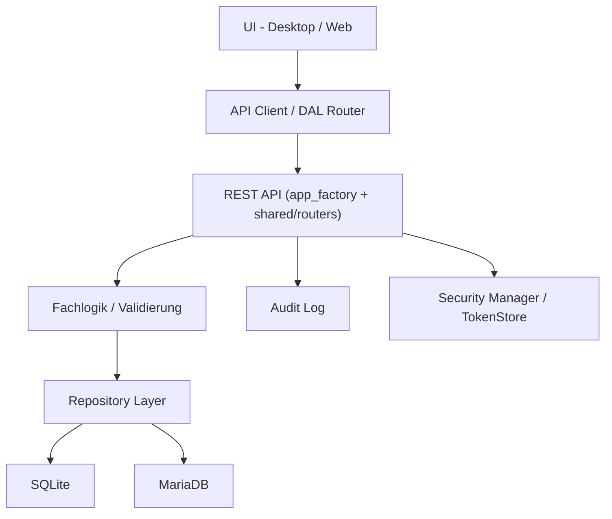

# Systemarchitektur

## Architekturprinzipien

ND-Hub folgt einigen klaren Leitplanken, die im gesamten Stack durchgehalten werden:

- **Server-first, modulare Clients**: Fachlogik liegt im Backend; Desktop und Web
  konsumieren dieselben Regeln ueber API-Schnittstellen.
- **Shared API-Router**: Domain-Routen leben unter `shared/routers/*` und werden
  von Desktop- und Web-Factory eingebunden.
- **API-Vertrag stabil halten**: SQLite oder MariaDB sind austauschbare Storage-
  Implementierungen; die API aendert sich dadurch nicht.
- **Auditierbarkeit by Default**: Aenderungen an Stammdaten werden ueber
  `api_audit_log` erfasst.
- **Idempotenz und Wiederaufnahme**: Sync- und Import-Strecken arbeiten
  fingerprint-/batch-basiert.
- **Konfigurations- vs. Datenpfad-Trennung**: insbesondere im Desktop Client
  sind `APPDATA`/Config-Pfade strikt von Programmdateien getrennt.

## High-Level System

## Komponenten im Detail

### Desktop Client (`desktop-client/`)

| Modul | Zweck |
|---|---|
| `nd_hub.py` | Haupteinstiegspunkt und Orchestrator. |
| `core/config_manager.py` | Pfad- und Einstellungsmanagement (APPDATA/Linux Home). |
| `core/error_handler.py` | Globaler Exception-Hook und Fehler-Dialoge. |
| `core/data_access_layer.py` | Router lokal vs. remote (Hybrid-Modus). |
| `core/sync_service.py` / `core/sync_worker.py` | Push-/Pull-Mechanik (Worker-Thread). |
| `core/secure_token_store.py` | Token in Keyring/Fernet statt Klartext-INI. |
| `core/db/*` | DB-Mixins (Analytics, Sync-Outbox, Setup-Wizard, CRUD). |
| `db_manager.py` | SQLite-Facade (<500 LOC), delegiert an Mixins. |
| `security_manager.py` | bcrypt, Account-Sperre, Passwortregeln. |
| `ui/pages/*` | UI-Seiten inkl. **Analytics Control Center**. |
| `ui/dialogs/*` | Login, Setup-Wizard-Package, Detailansichten. |
| `backend/app.py` | Duenner Shim → `backend/app_factory.create_app`. |
| `backend/app_factory.py` | FastAPI-Factory (Desktop-eingebettet). |

### Webanwendung (`ndhub-web/`)

| Modul | Zweck |
|---|---|
| `backend/app.py` | Duenner Shim (wenige LOC) → `create_app`. |
| `backend/app_factory.py` | FastAPI-Factory: Lifecycle, Middleware, Router-Mount. |
| `shared/routers/*` | Domain-Router (auth, users, depots, praeparate, … reports). |
| `backend/routers/sync.py` | Web-only Hybrid-Sync. |
| `backend/routers/institutions.py` | Multi-Institution / Onboarding / Geo. |
| `backend/routers/desktop_sync_auth.py` | Desktop-Sync-Auth. |
| `backend/auth.py` | Token-Store und Authentifizierung. |
| `backend/database.py` | `SqliteRepository`, Schemaverwaltung. |
| `backend/mariadb_repository.py` | MariaDB-Pfad mit optionalem Dual-Write. |
| `backend/helpers.py` | Shared Helper (Imports, Backups, Reports-Hilfen). |
| `backend/config.py` | Resolver fuer Engines, Pfade und SMTP. |
| `security_manager.py` | Passwortpolitik (Web-Kopie / Dual-Stack, siehe #94). |
| `frontend-react/` | Vite/React-Frontend. |
| `Dockerfile`, `docker-compose.yml` | Deployment-Stack (Default: MariaDB). |

### Shared (`shared/`)

| Modul | Zweck |
|---|---|
| `shared/routers/*.py` | Domain-Router, von Desktop- und Web-Factory genutzt. |
| `shared/security/` | Kanonische Passwort-Policy (`hash_password` / `verify_password`, bcrypt/PBKDF2). |
| `shared/backend_helpers/` | Reine Helper (Datum, Verfall, Permissions-Sets, Dateinamen) ohne FastAPI. |
| `ndhub-web/backend/repository_abc.py` | `AbstractRepository` Vertrag (SQLite + MariaDB). |
| `ndhub-web/backend/sql_dialect.py` | Shared SQL-Fragmente + Placeholder-Dialekt (`?` / `%s`). |
| `ndhub-web/backend/repository_factory.py` | Factory waehlt Engine via `ND_HUB_DB_ENGINE`. |

Desktop- und Web-`security_manager.py` bleiben Adapter (DB-Cursor, MariaDB-Hooks bzw. Shared-Connection);
Hash/Verify kommen aus `shared.security`. Backend-`helpers` re-exportieren shared-Funktionen unter den
historischen `_`-Namen (Monkeypatch-Stabilität).

### Externe Abhaengigkeiten

- **MariaDB 11.4** als zentrale Datenbank in produktionsnahen Umgebungen.
- **SMTP-Server** (optional) fuer Liveversand von E-Mails.
- **Reverse Proxy / TLS-Terminator** in produktiven Deployments empfohlen
  (siehe [Operations / Runbooks](../operations/01-runbooks.md)).

## Schichtenmodell

## Konfigurations- und Datenpfade

| Komponente | Programmpfad | Daten-/Konfigpfad |
|---|---|---|
| Desktop Windows | App-Verzeichnis | `%APPDATA%/ND-Hub/` |
| Desktop Linux | App-Verzeichnis | `~/.ND-Hub/` |
| Web Container | `/app` | `/data` (DB, Uploads, Backups als Volumes) |

## Designprinzipien fuer Erweiterungen

- Neue Domain-Endpunkte bevorzugt in `shared/routers/` legen und in beiden Factories mounten.
- Web-only-Verhalten (Sync, Multi-Institution) bleibt unter `ndhub-web/backend/routers/`.
- Desktop-DB-Erweiterungen als Mixin unter `core/db/`, nicht als Monolith in `db_manager.py`.
