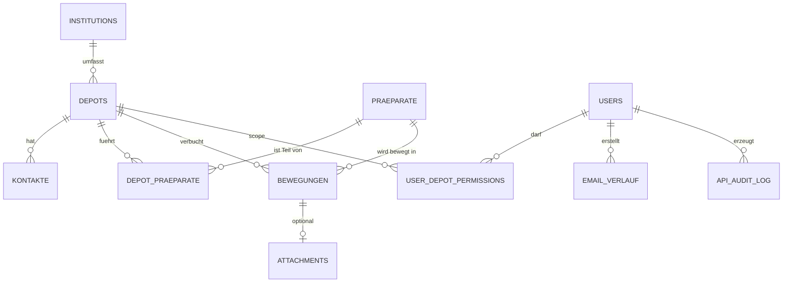

# Datenmodell

Diese Seite beschreibt das fachliche Datenmodell von ND-Hub mit den
wichtigsten Entitaeten, Beziehungen und Tabellen. Die Tabellen werden
auf SQLite (Desktop und Web-Default) sowie MariaDB (Web-Zielbild)
identisch fachlich abgebildet, mit kleinen Typunterschieden gemaess
[SQLite vs. MariaDB](../migration-and-sync/01-sqlite-vs-mariadb.md).

## Kernentitaeten und Beziehungen

## Tabellenuebersicht

### Stammdaten

| Tabelle | Zweck | Kernfelder |
|---|---|---|
| `institutions` | Traegerorganisation einer Gruppe von Depots. | `id`, `name`, Adresse, Geo. |
| `depots` | Notfalldepot mit Standortinformationen. | `id`, `name`, `institution_id`, Adresse, Geo. |
| `praeparate` | Stammsatz pro Praeparat. | `id`, `name`, `wirkstoff`, `staerke`, `pzn`, `hersteller`. |
| `depot_praeparate` | Zuordnung Depot <-> Praeparat inkl. Sollbestand. | `depot_id`, `praeparat_id`, `sollbestand`. |
| `kontakte` | Ansprechpartner pro Depot. | `depot_id`, `name`, `rolle`, Telefon, E-Mail. |

### Operative Daten

| Tabelle | Zweck | Kernfelder |
|---|---|---|
| `bewegungen` | Ein-/Ausgang/Vernichtung pro Praeparat im Depot. | `typ` (`Zugang`/`Abgang`/`Vernichtung`), `charge`, `verfall`, `eingang_datum`, `ausgang_datum`, `anzahl`, optional `datei_*` (PDF). |
| `email_verlauf` | Historie von Draft-/SMTP-Mails. | `betreff`, `nachricht`, `empfaenger_*`, `versand_status`. |
| `meldungs_tracking` (Desktop) | Tracking von Verfallsmeldungen. | depot/praeparat-bezogen. |

### Plattform- und Steuerungsdaten

| Tabelle | Zweck | Kernfelder |
|---|---|---|
| `users` | Benutzerkonten. | `username`, `password_hash`, Rolle, Aktiv-Flag. |
| `user_depot_permissions` | Berechtigungen je Benutzer und Depot. | `username`, `depot_id`, `can_read`, `can_write`. |
| `api_audit_log` | Audit-Trail aller relevanten API-Aktionen. | `timestamp`, `actor`, `action`, `resource_type`, `resource_id`. |
| `sync_push_batches` | Idempotenz-Tracking fuer Sync-Push. | `batch_id`, `username`, Zeitstempel. |
| `import_batches` | Idempotenz-Tracking fuer Imports. | `batch_id`, `username`, Fingerprint. |
| `app_write_lease` (Desktop) | Lokales Schreib-Lease. | Inhaber, Zeit. |
| `sync_outbox` (Desktop) | lokale Outbox fuer Hybrid-Sync. | Operation, Payload, Status. |

## Felddetails fuer wichtige Tabellen

### `bewegungen`

| Feld | Beschreibung |
|---|---|
| `id` | Primaerschluessel. |
| `depot_id` | Referenz auf Depot. |
| `praeparat_id` | Referenz auf Praeparat. |
| `charge` | Chargenkennung. |
| `verfall` | ISO-Datum (`YYYY-MM-DD`). |
| `eingang_datum` / `ausgang_datum` | Bewegungsdatum (ISO). |
| `empfaenger` | optionaler Empfaenger bei Abgaengen. |
| `anzahl` | Stueckzahl. |
| `typ` | `Zugang`, `Abgang` oder `Vernichtung`. |
| `datei_pfad`, `datei_name`, `datei_groesse`, `datei_hochgeladen_am` | Metadaten optionaler PDF-Anhaenge. |

### `depots` und `institutions`

- Optionale Geo-Felder (`latitude`, `longitude`) erlauben Karten-Features
  (`/map/institutions`).
- `institution_id` verknuepft Depots mit ihrer Traegerorganisation und ist
  Grundlage fuer das optionale Multi-Institution-Feature
  (`ND_HUB_FEATURE_MULTI_INSTITUTION`).

### `users` und Rechte

- `username` ist Schluesselfeld; passwortbasiert mit bcrypt-Hashes.
- Aktivitaet wird ueber `auth_activity`/Audit erfasst (Login, Reset, Unlock).
- `user_depot_permissions` erlaubt feingranulare Lese-/Schreibrechte je Depot.

## Hinweise zur Datenhaltung

- ISO-Daten werden konsistent als `YYYY-MM-DD` (Datum) bzw. UTC-Zeitstempel
  (DateTime) gespeichert.
- Booleans werden in SQLite als `INTEGER 0/1` und in MariaDB als `TINYINT(1)`
  abgebildet.
- IDs sind numerisch, monoton wachsend und ueber Engines identisch nutzbar.
