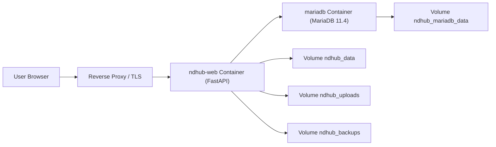
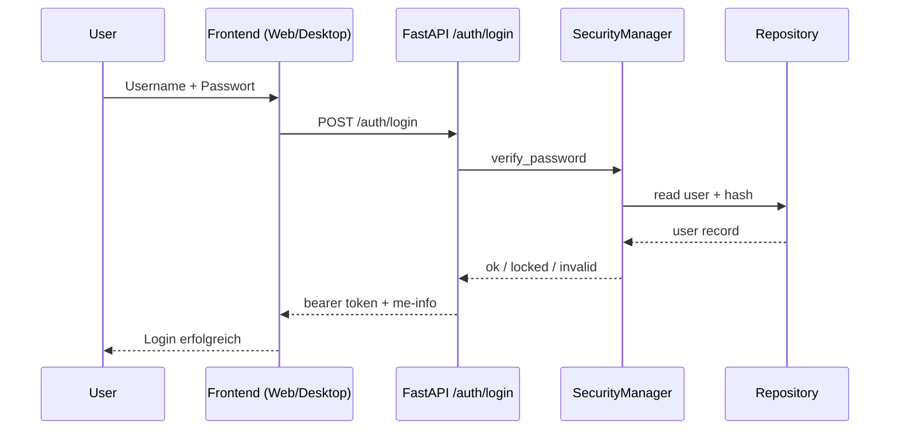
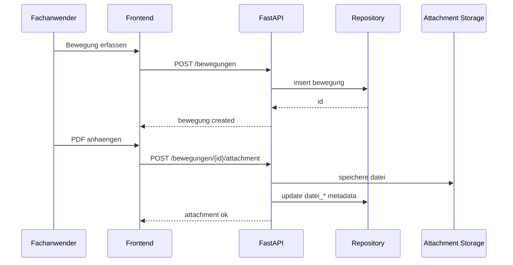
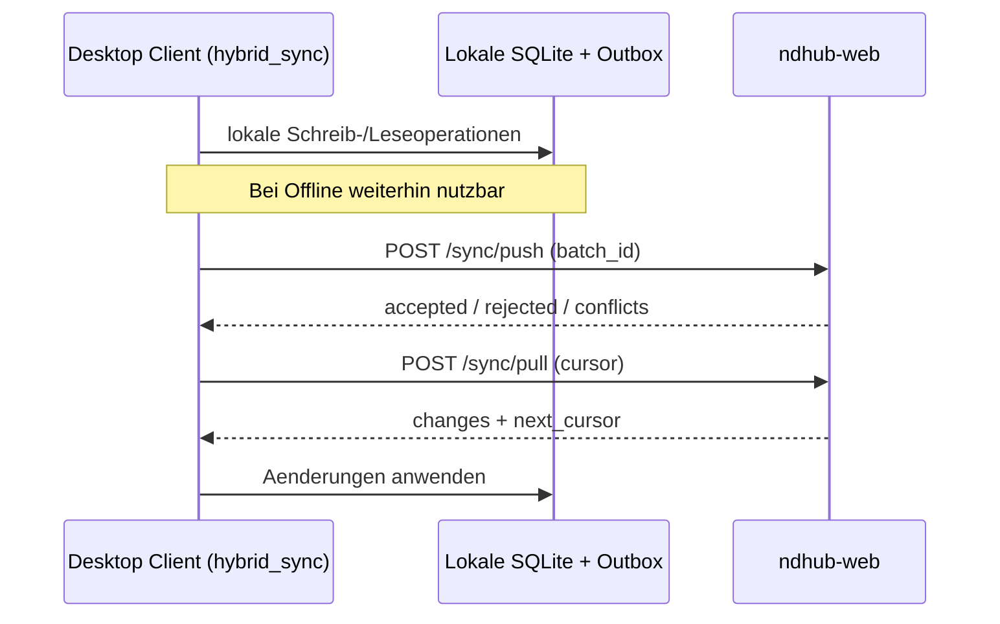
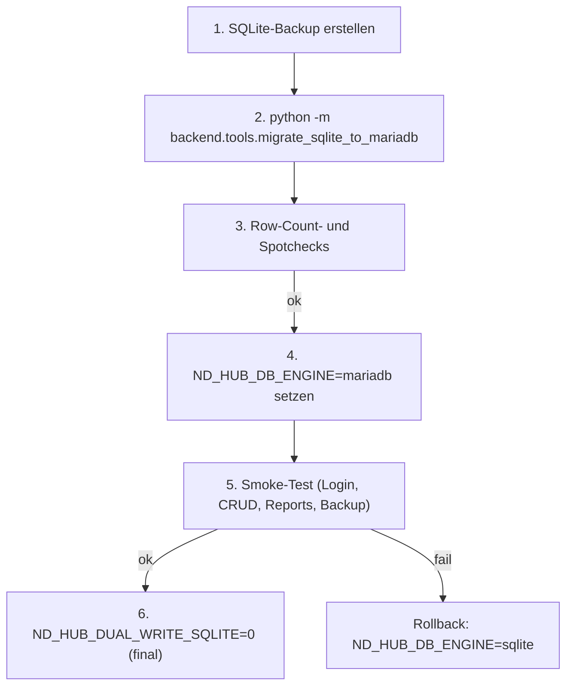
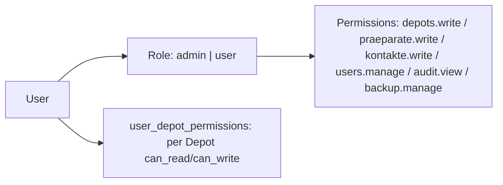
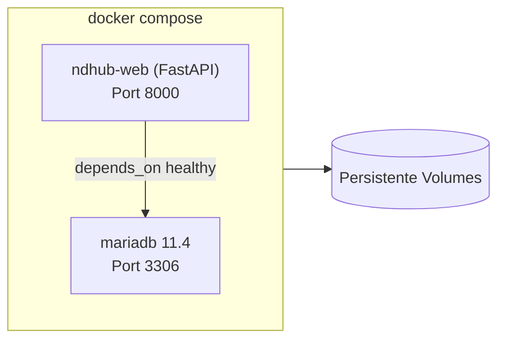

# Diagramme

Diese Seite buendelt die wichtigsten Mermaid-Diagramme zu ND-Hub.

## Deployment-Topologie (Web)

## Login-Flow

## Bewegung mit PDF-Anhang

## Hybrid-Sync v1

## MariaDB-Cutover

## Berechtigungen / Rollen

## Container-Stack

