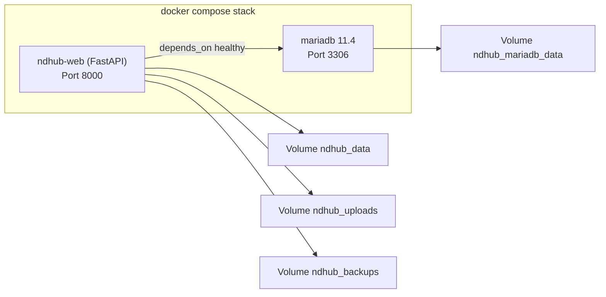

# Docker-Stack

Diese Seite beschreibt den **tatsaechlichen aktuellen Deployment-Stand**
der Webanwendung mit Docker. **Produktdokumentation:** v0.5; **ndhub-web**
(FastAPI- und npm-Packageversion): **0.1.1**.

## Topologie

Der Stack besteht aus zwei Services und persistenten Volumes:



## Services

### `ndhub-web`

| Eigenschaft | Wert |
|---|---|
| Image | Standard: lokaler Build aus `ndhub-web/Dockerfile`; optional vorgebautes Image ueber `NDHUB_WEB_IMAGE` (siehe [Container-Registry](#container-registry-github-actions) und [Umgebungsvariablen](03-environment-variables.md)). |
| Basis | `python:3.12-slim` (Frontend-Stage `node:20-slim`) |
| Port | `8000` |
| Healthcheck | `GET /health` (intern via `urllib`) |
| Restart | `unless-stopped` |
| Default-Engine | `ND_HUB_DB_ENGINE=mariadb` |
| Host-Bind | `127.0.0.1:8000` (Issue #108; Override `ND_HUB_WEB_BIND`) |

### `mariadb`

| Eigenschaft | Wert |
|---|---|
| Image | `mariadb:11.4` |
| Port | `3306` |
| Healthcheck | `healthcheck.sh --connect --innodb_initialized` |
| Volume | `ndhub_mariadb_data:/var/lib/mysql` |

## Container-Registry (GitHub Actions)

Bei Push auf `main` und bei Git-Tags `v*` baut der Workflow
`.github/workflows/publish-ndhub-web-image.yml` das Web-Image und pusht es nach:

- **GHCR:** `ghcr.io/quasiniusquaks/nd-hub` (Paket mit dem GitHub-Repository verknuepft)
- **Docker Hub (optional):** `docker.io/spypanther/ndhub-web`, wenn die
  Repository-Variable `DOCKERHUB_PUSH` den Wert `true` hat und die Action-Secrets
  `DOCKERHUB_USERNAME` sowie `DOCKERHUB_TOKEN` gesetzt sind.

Zum Betrieb mit Registry-Image: in `ndhub-web/.env` z. B.
`NDHUB_WEB_IMAGE=ghcr.io/quasiniusquaks/nd-hub:latest` setzen, dann
`docker compose pull ndhub-web` und `docker compose up -d --no-build`
(siehe auch [README](../../README.md) Abschnitt Docker).

## Voraussetzungen

- Docker Engine + Docker Compose Plugin installiert.
- Port `8000` und (bei externer DB-Nutzung) `3306` verfuegbar.
- Fuer produktionsnahe Umgebungen: gepflegte `.env` mit sicheren Secrets.

## Konfiguration vorbereiten

```bash
cd ndhub-web
cp .env.example .env
```

`ND_HUB_MARIADB_PASSWORD` und `ND_HUB_MARIADB_ROOT_PASSWORD` sind Pflicht.
Leere Werte: Compose bricht ab (`${VAR:?...}`). Es gibt kein Default-Passwort
im YAML. Platzhalter `__CHANGE_ME__` vor dem Start ersetzen.

Wichtige Variablen siehe [Umgebungsvariablen](03-environment-variables.md).

## Deployment starten

```bash
cd ndhub-web
docker compose up -d --build
```

Nach erfolgreichem Start verfuegbar:

- App/API: `http://localhost:8000`
- Health: `http://localhost:8000/health`

## Betriebsmodi

### MariaDB-Modus (empfohlen fuer Staging/Production)

- `.env`: `ND_HUB_DB_ENGINE=mariadb`
- Compose startet `mariadb` automatisch mit.
- `depends_on: condition: service_healthy` stellt sicher, dass
  `ndhub-web` erst nach DB-Healthcheck startet.

### SQLite-Modus (lokaler/test-Betrieb)

- `.env`: `ND_HUB_DB_ENGINE=sqlite`
- Backend nutzt `ND_HUB_DB_PATH=/data/nd_hub_backend.db`.
- Der Stack enthaelt weiterhin den MariaDB-Service; fachlich nutzt das
  Backend in diesem Modus aber SQLite.

## Healthchecks und Verifikation

```bash
cd ndhub-web
docker compose ps
docker compose logs -f ndhub-web
```

Minimalpruefung nach Deploy:

- `GET /health` liefert HTTP `200`.
- Login funktioniert.
- Kernflows (Bewegungen, Reports, Backup-Liste) ohne Fehler.

## Persistenz

| Volume | Inhalt |
|---|---|
| `ndhub_data` | SQLite-Datei (im SQLite-Modus) und kleinere Datenartefakte. |
| `ndhub_uploads` | PDF-Anhaenge der Bewegungen. |
| `ndhub_backups` | Backups (logisch, JSON oder MariaDB-Dumps). |
| `ndhub_mariadb_data` | Datenverzeichnis von MariaDB. |

## Update- und Restart-Operationen

**Lokaler Build (Standard):**

```bash
cd ndhub-web
docker compose pull
docker compose up -d --build
docker compose restart ndhub-web
```

`docker compose pull` aktualisiert dabei vor allem das MariaDB-Basisimage;
`ndhub-web` wird ueber `--build` neu erzeugt, sofern kein `NDHUB_WEB_IMAGE`
gesetzt ist.

**Vorgefertigtes Web-Image (`NDHUB_WEB_IMAGE` gesetzt):**

```bash
cd ndhub-web
docker compose pull ndhub-web
docker compose up -d --no-build
docker compose restart ndhub-web
```

Hinweis: Bei Aenderungen an `.env` oder Dependencies den Stack neu
erzeugen (`up -d --build` bzw. nach Registry-Update erneut `pull` und
`up -d --no-build`).

## Backup, Restore und Betriebssicherheit

- Persistente Daten liegen in Volumes (DB, Uploads, Backups).
- Backup/Restore-Endpunkte sind gehaertet (Format-/Groessenpruefung).
- Engine-aware Backup-Dateinamen:
  - SQLite: `*.json` mit Engine-Marker.
  - MariaDB: `*.mariadb.json` (logischer JSON-Dump).
- Fuer MariaDB-Cutover und produktive Freigabe siehe
  [Migration & Sync / MariaDB-Cutover](../migration-and-sync/02-mariadb-cutover.md).

## Produktionsnahe Mindest-Checkliste

- Starke Passwoerter/Secrets in `.env`.
- `ND_HUB_DB_ENGINE=mariadb` fuer zentrale Umgebung aktiv.
- `ND_HUB_DUAL_WRITE_SQLITE=0` ausserhalb kontrollierter
  Uebergangsfenster.
- Healthchecks gruen, Smoketests bestanden.
- Backup-Restore-Test einmal in Zielumgebung validiert.
- E-Mail-Betrieb bewusst dokumentiert (`draft` oder `smtp`).

## Beispiel `docker-compose.yml` (Auszug)

```yaml
services:
  ndhub-web:
    build: .
    image: ${NDHUB_WEB_IMAGE:-ndhub-web:local}
    container_name: ndhub-web
    restart: unless-stopped
    ports:
      - "8000:8000"
    env_file:
      - .env
    depends_on:
      mariadb:
        condition: service_healthy
    volumes:
      - ndhub_data:/data
      - ndhub_uploads:/data/uploads
      - ndhub_backups:/data/backups
    healthcheck:
      test: ["CMD", "python", "-c", "import urllib.request; urllib.request.urlopen('http://127.0.0.1:8000/health', timeout=3)"]

  mariadb:
    image: mariadb:11.4
    container_name: ndhub-mariadb
    restart: unless-stopped
    volumes:
      - ndhub_mariadb_data:/var/lib/mysql
    healthcheck:
      test: ["CMD", "healthcheck.sh", "--connect", "--innodb_initialized"]

volumes:
  ndhub_data:
  ndhub_uploads:
  ndhub_backups:
  ndhub_mariadb_data:
```
