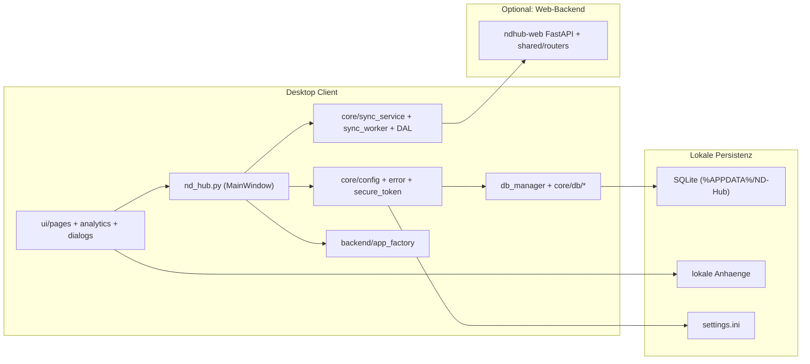

# Desktop Client: Ueberblick

## Steckbrief

| Eigenschaft | Wert |
|---|---|
| Sprache | Python 3.10+ (CI: 3.12 Linux; lokal 3.10/3.11 ok) |
| UI-Framework | PySide6 (Qt 6) |
| Datenbank lokal | SQLite (WAL-Mode, optimierte PRAGMAs) |
| DB-Schicht | `db_manager.py` Facade + Mixins unter `core/db/*` |
| Eingebettetes Backend | FastAPI via `backend/app_factory.py` |
| Sicherheit | bcrypt, Account-Sperre, erzwungener Passwortwechsel, SecureTokenStore |
| Build | PyInstaller + Inno Setup (Windows) |
| Lieferform | Quellcode oder Windows-Installer |

## Hauptmerkmale

- **Modernes UI** im Apple-inspirierten Design mit dynamischem Dark Mode.
- **Robustes Path-Management** ueber den `ConfigManager`. Daten und Code
  sind strikt getrennt.
- **Globales Error-Handling** mit professionellem Fehlerdialog statt
  abrupten Anwendungsabbruechen.
- **Setup-Wizard** (Package unter `ui/dialogs/…`) fuer gefuehrte Erstkonfiguration.
- **Analytics Control Center** unter `ui/pages/analytics/**`.
- **Hybrid-Modus** ueber Sync-Service/Worker, alternativ vollstaendiger
  Local-only-Betrieb ohne Backend.
- **Audit-Tab** und Backup-/Restore-Funktionen direkt in der UI.

## Architektur in Kurzform

## Betriebsmodi

| Modus | Beschreibung | Wann sinnvoll? |
|---|---|---|
| `local_only` | Vollstaendig lokal, keine Backend-Abhaengigkeit. | Einzelarbeitsplaetze ohne zentrale Web-Instanz. |
| `hybrid_sync` | Lokal-zuerst, synchronisiert mit Web-Backend, wenn erreichbar. | Standorte mit zentraler Plattform und Offline-Anforderung. |
| `remote_only` | Nur Online; Schreibzugriff erfordert Backend. | Sonderfaelle ohne Offline-Bedarf. |

Details zur Sync-Mechanik siehe
[Migration & Sync / Hybrid-Sync](../migration-and-sync/03-hybrid-sync.md).

## Beziehung zur Webanwendung

Der Desktop Client teilt mit `ndhub-web` denselben fachlichen Kern und —
soweit moeglich — dieselben Domain-Router unter `shared/routers/*`.
Wesentliche Aenderungen an Domaenenregeln werden serverseitig gehalten.
Funktionsparitaet: [Projekt / Parity-Matrix](../project/02-parity-matrix.md).
