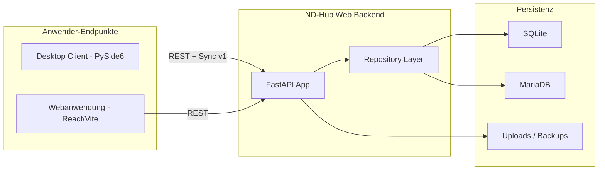

# ND-Hub Enterprise Documentation

  

Willkommen in der zentralen Enterprise-Dokumentation von **ND-Hub** (Stand: **v0.5**).
Diese Doku beschreibt den **Desktop Client** und die **Webanwendung** vollstaendig:
Architektur, Funktionen, Betrieb, Sicherheit, API, Migration und Roadmap.

!!! info "Zielgruppe dieser Dokumentation"
    Diese Dokumentation richtet sich gleichermassen an
    **Fachadministration**, **IT-Operations**, **Entwicklungsteams** und
    **Entscheider/Compliance**, die ND-Hub bewerten, einfuehren oder produktiv betreiben.

## Was ist ND-Hub?

ND-Hub ist eine spezialisierte Plattform zur **strukturierten Verwaltung von Notfalldepots**.
Sie wird parallel als **Desktop Client (PySide6)** und als **Webanwendung (FastAPI + React)**
bereitgestellt und basiert auf einem gemeinsamen fachlichen Kern (Depots, Praeparate,
Bewegungen, Verfall, Berichte, Audit, Backup/Restore).

## Schnellnavigation

| Bereich | Inhalt |
|---|---|
| [Overview](overview/index.md) | Produktbeschreibung, Zielgruppen, Feature-Ueberblick |
| [Architektur](architecture/index.md) | Systemarchitektur, Datenmodell, Diagramme |
| [Desktop Client](desktop-client/index.md) | Installation, Konfiguration, Funktionen, UI-Seiten, Builds |
| [Webanwendung](web-application/index.md) | Frontend, Backend, Endpunkte, Funktionen |
| [Deployment](deployment/index.md) | Docker-Stack, Umgebungen, ND_HUB_*-Variablenreferenz, Update/Rollback |
| [Operations](operations/index.md) | Runbooks, Backup/Restore, Monitoring, Incident Response |
| [Security](security/index.md) | AuthN/AuthZ, Datenschutz, Audit-Logs, Security Review |
| [API Reference](api-reference/index.md) | REST-Endpunkte, Fehlerbehandlung, Pagination/Filter |
| [Migration & Sync](migration-and-sync/index.md) | SQLite vs. MariaDB, Cutover, Hybrid-Sync |
| [Qualitaet & Tests](quality/index.md) | Teststrategie, Acceptance, Performance |
| [Projekt & Roadmap](project/index.md) | PSP/Sprintplan, Parity-Matrix, Release Notes |
| [Referenz](reference/index.md) | Glossar, FAQ |
| [Archiv](legacy/index.md) | Archivierte Originaldokumente |

## Versions- und Quellen-Hinweise

- Aktuelle Version: **v0.5**
- Quellrepository: `desktop-client/` und `ndhub-web/`
- Single Source of Truth fuer Themenbereiche ist diese Site;
  Originaldokumente verbleiben unter [Archiv](legacy/index.md) als historische Referenz.
