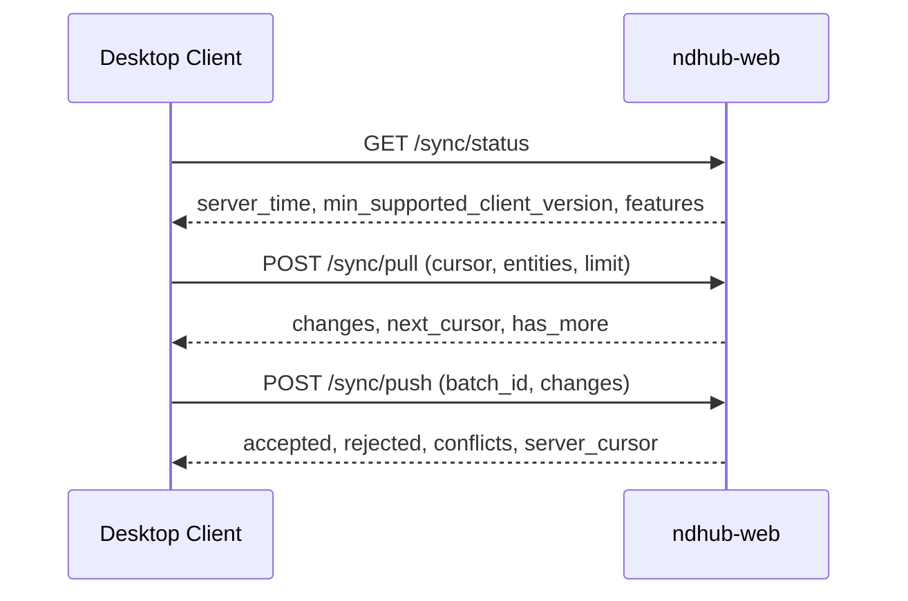

# Hybrid-Sync v1

ND-Hub trennt Desktop und Web-Backend ueber einen klar definierten
Sync-Vertrag. Diese Seite beschreibt die Mechanik aus dem
Sync-Contract v1 fuer den Stand v0.5.

## Ziele

- Desktop synchronisiert ausschliesslich ueber API, **nicht** ueber
  direkten DB-Zugriff.
- Synchronisation bleibt nach SQLite-MariaDB-Migration unveraendert.
- Idempotenz und Wiederaufnahme nach Netzunterbrechungen sind
  verpflichtend.
- Desktop bleibt auch ohne Backend voll lokal arbeitsfaehig
  (SQLite bleibt Write-Store).

## Betriebsmodi

| Modus | Verhalten |
|---|---|
| `local_only` | nur lokale Reads/Writes; kein Push, kein Pull. |
| `hybrid_sync` | lokal-zuerst; bei erreichbarem Backend Push/Pull. |
| `remote_only` | nur Online; bei fehlendem Backend sind Writes gesperrt. |

Konfiguration im Desktop ueber `settings.ini` (`operating_mode`).

## Translational Layer

- Desktop nutzt einen Data-Access-Router vor dem Sync-Service.
- Aufgaben:
    - lokal vs. remote zur Laufzeit entscheiden,
    - lokale Writes weiter zulassen,
    - sync-faehige Aenderungen in eine Outbox legen,
    - Push/Pull-Batches idempotent gegen das Backend ausfuehren.
- Das ist **eine Client-Schicht** und ersetzt nicht den
  Backend-Dual-Write.

## Domain-Scope

Synchronisiert werden:

- Stammdaten: `depots`, `praeparate`, `depot_praeparate`, `kontakte`.
- Bewegungen: `bewegungen` (ohne binaere Anhang-Dateien in v1).
- Metadaten: Sync-Cursor, Konfliktinformationen, Server-Zeitstempel.

## Datenmodell-Sicht

Jede sync-relevante Entitaet hat:

- `id`
- `updated_at` (UTC)
- `deleted_at` (optional fuer Tombstones)
- `version` (monoton, integer)

## Endpunkte

Implementierungsstand:

- `GET /sync/status` ist implementiert.
- `POST /sync/pull` ist als inkrementeller Audit-Changefeed mit Cursor
  umgesetzt.
- `POST /sync/push` ist mit idempotenter Batch-Deduplizierung
  (`batch_id`) umgesetzt.
- Push-Changeformat:
    - `entity`: `depots|praeparate|kontakte|bewegungen`
    - `operation`: `create|update|delete` (bei `bewegungen` in v1 nur
      `create`)
    - `payload`: fachliche Felder je Entity
    - optional `client_change_id` zur Korrelation

## Idempotenz und Reihenfolge

- Jeder Push-Batch enthaelt eine eindeutige `batch_id` (UUID).
- Server speichert verarbeitete `batch_id` und dedupliziert
  Wiederholungen.
- Gleiche `batch_id` -> kein Doppelschreiben.

## Konfliktregeln (v1)

- `update/update`: Last-write-wins mit Konflikthinweis fuer den Client.
- `delete/update`: delete gewinnt; update wird als Konflikt zurueckgegeben.
- `create/create` mit fachgleichem Schluessel: serverseitige
  Dublettenregel + Konflikthinweis.

## Fehlerverhalten

- Teilweise Batch-Verarbeitung erlaubt; Ergebnis pro Change muss
  eindeutig sein.
- Client speichert `rejected` und `conflicts` lokal und markiert die
  Datensaetze fuer Nacharbeit.
- 5xx -> Retry mit Backoff.
- 4xx -> fachlicher Fehler.

## Security

- Sync-Endpunkte sind tokenpflichtig wie regulaere API-Endpunkte.
- Jede synchronisierte Aenderung wird auditiert (Akteur, Aktion, Zeit).
- Rate-Limits sind fuer spaetere Phasen vorgesehen.

## Nicht-Ziele in v1

- Keine bidirektionale Synchronisation binaerer Anhang-Dateien.
- Kein vollautomatisches Konflikt-UI.
- Kein Multi-Master-Modus mit gleichzeitiger Schreibhoheit mehrerer
  Offline-Clients.

## Abnahmekriterien

- Pull seit `cursor` liefert konsistente Aenderungen ohne Luecken.
- Push ist idempotent unter Retry und Netzunterbrechung.
- Konflikte sind reproduzierbar und maschinenlesbar markiert.
- Migration auf MariaDB aendert den Sync-Vertrag nicht.
- `local_only` arbeitet voll lokal.
- `hybrid_sync` schreibt offline lokal weiter und synchronisiert nach
  Wiederverbindung ohne Duplikate.
