# Feature-Ueberblick

Diese Seite gibt eine konsolidierte Sicht auf alle Funktionen von ND-Hub
ueber Desktop und Web. Sie ist als Referenz fuer Evaluierung und
Vertriebsgespraeche gedacht. Detailbeschreibungen folgen in den jeweiligen
Produktbereichen ([Desktop](../desktop-client/index.md),
[Web](../web-application/index.md)).

## Funktionslandkarte

```mermaid
flowchart LR
    subgraph stammdaten["Stammdaten"]
        depots["Depots"]
        praeparate["Praeparate"]
        kontakte["Kontakte"]
        zuordnungen["Depot-Praeparat Zuordnungen"]
    end
    subgraph operativ["Operative Prozesse"]
        bewegungen["Bewegungen"]
        verfall["Verfall"]
        importExp["Import/Export"]
        emails["E-Mail-Workflows"]
    end
    subgraph analyse["Analyse & Reporting"]
        dashboard["Dashboard / KPI"]
        reports["Reports - Bestand/Bewegungen/Ranking/Matrix/Verfall"]
        exports["Exporte - CSV/PDF/PPTX"]
    end
    subgraph admin["Administration"]
        userMgmt["Benutzerverwaltung"]
        rights["Rechte / Rollen"]
        audit["Audit-Logs"]
        backupRestore["Backup / Restore"]
        setupWizard["Setup-Wizard"]
    end
    subgraph platform["Plattform"]
        sync["Hybrid-Sync v1"]
        engineSwitch["Engine-Switch SQLite/MariaDB"]
        docker["Docker Deployment"]
    end
    stammdaten --> operativ --> analyse
    admin --> stammdaten
    admin --> operativ
    platform --> admin
```

## Ueberblick je Funktionsbereich

### Stammdaten

- **Depots**: CRUD inkl. Suche und Pagination.
- **Praeparate**: CRUD inkl. Kategorisierung und Sollbestaende.
- **Zuordnungen**: definieren, welche Praeparate in welchem Depot gefuehrt
  werden, inkl. Sollbestand pro Depot.
- **Kontakte**: pro Depot pflegbar, Grundlage fuer E-Mail-Workflows.

### Operative Prozesse

- **Bewegungen**: Erfassung von Ein-/Ausgaengen mit Datum, Charge,
  Verfallsdatum, Anzahl und optionalem PDF-Anhang.
- **Bewegungs-Verlauf**: leistungsfaehiges Filtering (Typ, Depot, Praeparat,
  Datum, Anhang, Volltext), Pagination, persistente Filter pro Benutzer.
- **CSV-Export der Historie**: uebernimmt aktive Filter.
- **Import**: CSV/XLS(X) mit Vorschau, Fehlerklassifizierung,
  Idempotenz (Fingerprint) und Dry-Run.
- **Verfall**: Uebersichten mit Kategorisierung (z. B. abgelaufen,
  bald ablaufend), Exporte, Polling-Notifications.
- **E-Mail-Workflows**: Empfaenger-Vorschau pro Depot, Draft-Verlauf,
  optional SMTP-Liveversand (`ND_HUB_EMAIL_DELIVERY_MODE=smtp`).

### Analyse und Reporting

- **Dashboard**: KPI- und Aktivitaetenuebersicht.
- **Reports**: `bewegungen`, `bestand`, `ranking`, `matrix`, `verfall`.
- **Exportformate**: `CSV`, `PDF`, `PPTX` mit kontextreichen Dateinamen.
- **Datumsvalidierung**: alle Reports validieren ISO-Datumsformat und
  korrekte Reihenfolge (`start_date <= end_date`).

### Administration

- **Benutzerverwaltung**: Anlage, Reset, Unlock, Avatar, Aktivitaetslog.
- **Rollenmodell**: Admin, Fachanwender; gehaertete Selbstschutzregeln
  (letzter aktiver Admin geschuetzt).
- **Audit-Logs**: Filter (`action`, `resource_type`, Volltext), Pagination.
- **Backup/Restore**: Format-/Groessenpruefung, Engine-aware
  (`*.mariadb.json` oder `*.json`).
- **Setup-Wizard**: gefuehrte Erstkonfiguration im Desktop Client.

### Plattform und Betrieb

- **Hybrid-Sync v1**: `local_only`, `hybrid_sync`, `remote_only`.
  Lokale Outbox, Cursor-basiertes Pull, idempotenter Push, E2E-Tests.
- **Engine-Switch**: `ND_HUB_DB_ENGINE=sqlite|mariadb`, mit kontrolliertem
  Cutover-/Rollback-Pfad.
- **Docker-Deployment**: Compose-Stack `ndhub-web` + `mariadb`,
  Healthchecks und persistente Volumes.

## Funktionsmatrix Desktop vs. Web (Kurzform)

| Funktion | Desktop | Web | Anmerkung |
|---|---|---|---|
| Login / Rollen | ja | ja | gleiche Regeln |
| Depots / Praeparate / Zuordnungen | ja | ja | inkl. Suche/Paging |
| Bewegungen + Anhang | ja | ja | PDF, max. 10 MB |
| Verlauf-Filter / CSV-Export | ja | ja | persistente Filter pro User |
| Import (CSV/XLS) | ja | ja | inkl. Dry-Run |
| Reports + Exporte | ja | ja | CSV/PDF/PPTX |
| E-Mail Draft + History | ja | ja | optional SMTP-Live |
| Dashboard | ja | ja | KPIs / Aktivitaeten |
| Verfall-Uebersicht | ja | ja | inkl. Notifications |
| Audit-Logs | teilweise | ja | Filter/Paging im Web |
| Setup-Wizard | ja | teilweise | Web-Onboarding ist im Ausbau |
| Sync v1 | ja (Client) | ja (Server) | Push/Pull/Cursor |
| MariaDB-Modus | n/a | ja | Engine-Switch ueber Env |

Die vollstaendige, fortgeschriebene Parity-Matrix steht unter
[Projekt > Parity-Matrix](../project/02-parity-matrix.md).
