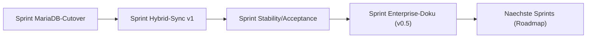

# Roadmap & PSP

ND-Hub wird als Plattform geplant: zentrales Backend, Webanwendung,
Desktop-Client und optionaler hybrider Betrieb. Diese Seite konsolidiert
die wichtigsten Inhalte aus dem Projektplan
(`desktop-client/entwicklung.md`).

## Projektkontext

- Ausgangspunkt: bestehender PySide6-Desktop-Client mit SQLite.
- Zielbild: server-first Plattform mit Web- und Desktop-Clients.
- Vorgehen: inkrementell, 2-Wochen-Sprints, Projektstrukturplan (PSP)
  mit klar abgegrenzten Arbeitspaketen.

## Ziele

| Ziel | Beschreibung | Prioritaet |
|---|---|---|
| Z1 | Zentrale Serverplattform fuer ND-Hub | Muss |
| Z2 | Webanwendung fuer Standardzugriff | Muss |
| Z3 | Desktop-Client fuer Power-User und lokale Nutzung | Muss |
| Z4 | Unterstuetzung lokal/online/hybrid | Soll |
| Z5 | Nachvollziehbarkeit durch Rollen, Audit, Historie | Muss |
| Z6 | Docker-basiertes Deployment | Muss |

## MVP-Scope

| Bereich | Im MVP enthalten | Nicht im MVP |
|---|---|---|
| Benutzer | Login, Rollen, Basisrechte | SSO, Mandantenfaehigkeit |
| Depots | Anlegen, Bearbeiten, Suchen, Zuordnen | Freigabeworkflows |
| Praeparate | Stammdaten, Kategorisierung, Zuordnung | Erweiterte Importe |
| Bestaende | Bewegungen, Historie | Mobile Lagerprozesse |
| Reporting | Basisexporte, einfache Berichte | Umfangreiche BI-Suite |
| Sync | Grundlegender Hybridmodus | Konfliktassistenz V2 |

## Annahmen

- Sprintlaenge: 2 Wochen.
- Schaetzmethode: Personentage.
- Architekturprinzip: server-first, modulare Clients.
- Kritischer Risikobereich: Sync/Hybridbetrieb.

## Rollen im Projekt

- PM / Product Owner
- Tech Lead / Architect
- Backend Engineer
- Desktop Engineer
- Web Engineer
- QA / Testkoordination
- DevOps

## Projektstrukturplan (PSP) - Top-Level

| Paket | Inhalt |
|---|---|
| 1. Projekt & Steuerung | Planung, Stakeholder, Backlog, Releaseplanung. |
| 2. Architektur & Plattform | Zielarchitektur, Modulkonzept, Sicherheit. |
| 3. Backend (FastAPI) | API, Auth, Repositories, Reports, Imports, Sync. |
| 4. Webanwendung | Frontend, Integration, UX. |
| 5. Desktop Client | UI, lokale Persistenz, Sync-Service, Builds. |
| 6. Daten & Migration | SQLite/MariaDB, Migration, Backup. |
| 7. Qualitaet & Tests | Strategie, Suites, Performance, Security. |
| 8. Operations & Deployment | Docker, Runbooks, Monitoring. |
| 9. Dokumentation & Schulung | Enterprise-Doku (diese Site). |

## Sprint-Setup (Auszug)

- 2-Wochen-Sprints mit klarer Definition of Ready/Done.
- Sprint-Goals fokussieren auf eine fachliche Saeule (z. B. Reports,
  Sync, MariaDB-Cutover).
- Pro Sprint: Acceptance-Suite gruen + Smoke gegen Stack.

## Aktuelle Phasen (vereinfacht)

## Naechste sinnvolle Schritte (Outlook)

- Frontend-E2E-Suite ausbauen (Browserseitig).
- Externer Session-Store fuer horizontalen Skalierungs-Pfad.
- Konfliktassistenz V2 (Sync) und partielles Attachment-Sync.
- Multi-Institution / Mandantenfunktionen ausweiten.
- Erweiterte Reporting- und BI-Funktionen.
