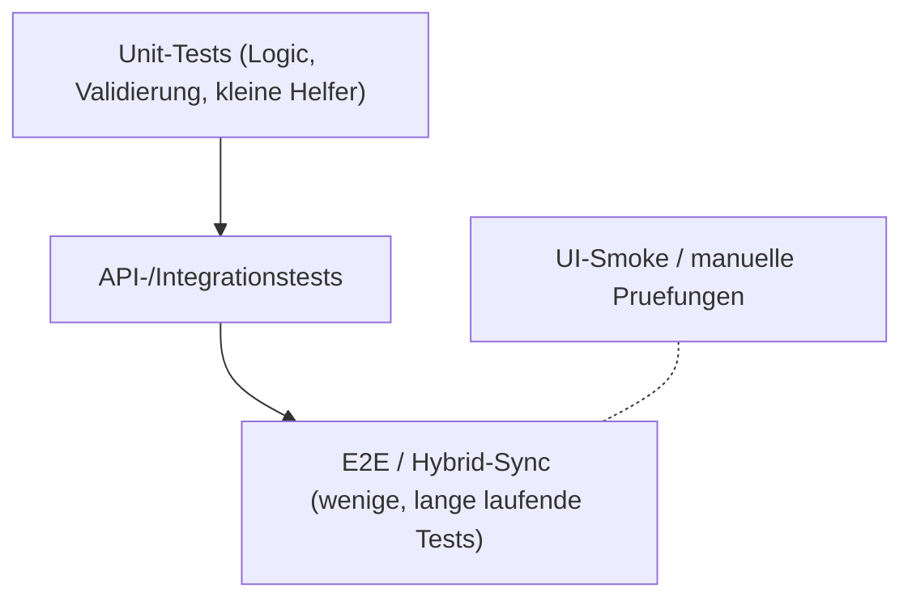

# Teststrategie

ND-Hub setzt auf eine schichtenabhaengige Teststrategie. Ziel ist es,
Regressionen frueh zu erkennen und das Quality-Gate vor Releases
verlaesslich zu erfuellen.

## Test-Pyramide



## Toolset

| Schicht | Werkzeug |
|---|---|
| Unit/API (Backend) | `pytest`, FastAPI-`TestClient` |
| Linting | `ruff` (Format und Lint) |
| Security | `bandit`, optional `pip-audit` / `npm audit` |
| Frontend | `vite build`, `npm test` (sofern eingerichtet) |
| Performance | `pytest -m performance --no-cov` (lokal / manuell) |
| End-to-End Sync | `backend/tests/test_sync_hybrid_e2e.py` |

## CI (implementiert)

Workflow: [`.github/workflows/ci.yml`](../../.github/workflows/ci.yml) — Name **CI**.

Laeuft auf `pull_request` und `push` zu `main` (Linux / Python 3.12):

| Job | Inhalt | Blocking |
|---|---|---|
| **Ruff** | `desktop-client/`, `ndhub-web/`, `shared/` (jeweils package-`pyproject.toml`) | ja |
| **Desktop unit** | `pytest tests/unit` mit PySide6-Stub; Ignore `test_sync_worker.py` (braucht echte Qt-Signals) | ja |
| **Web API** | `test_smoke.py` + `test_security_headers.py` (SQLite, kein MariaDB) | ja |
| **Bandit** | medium+ (`-ll`) mit Root-`.bandit.yml` | ja |
| **CI success** | Aggregat-Job fuer Branch Protection | ja |

**Nicht** in Phase-1-CI (Follow-ups):

- Windows-Runner / Python-Matrix 3.10/3.11
- Coverage-Upload als Artefakt (Fail-under fuer Desktop-Kernmodule laeuft im Desktop-Job)
- `pip-audit` / `npm audit` als harte Gates
- Performance-Suite (kein `workflow_dispatch` „Performance Tests“ — lokal via `pytest -m performance`)
- Image-Publish (`publish-ndhub-web-image.yml`) laeuft nur nach erfolgreichem **CI**
  (`workflow_run`, Issue #109). PR-CI published nicht. Zusaetzlich empfohlen:
  Branch Protection Required Check **CI success**.

## Wichtige Suiten (Backend)

- `test_stability_acceptance.py`
- `test_user_admin_hardening.py`
- `test_report_export_hardening.py`
- `test_backup_restore_hardening.py`
- `test_import_idempotency.py`
- `test_email_delivery.py`
- `test_bewegungen_filters.py`
- `test_sync_ops_stats.py`
- `test_sync_hybrid_e2e.py`

Diese Suiten bilden die Stability/Acceptance-Regression
([Acceptance-Suite](02-acceptance-suite.md)) und laufen **lokal**/vor Release;
Phase-1-CI deckt Smoke + Security-Headers ab.

## Beispielaufrufe

```bash
# Desktop Unit (Stub-Pfad, wie CI)
cd desktop-client
pip install -r requirements-dev.txt
pytest tests/unit -m "not performance" --ignore=tests/unit/test_sync_worker.py

# Web Smoke (wie CI)
cd ndhub-web
PYTHONPATH="backend:.." ND_HUB_DB_ENGINE=sqlite \
  pytest backend/tests/test_smoke.py backend/tests/test_security_headers.py --no-cov
```

```bash
# Stability/Acceptance-Suite (vom Repository-Root)
PYTHONPATH="ndhub-web" \
  python -m pytest \
  ndhub-web/backend/tests/test_stability_acceptance.py \
  ndhub-web/backend/tests/test_user_admin_hardening.py \
  ndhub-web/backend/tests/test_report_export_hardening.py \
  ndhub-web/backend/tests/test_backup_restore_hardening.py \
  ndhub-web/backend/tests/test_import_idempotency.py \
  ndhub-web/backend/tests/test_email_delivery.py \
  ndhub-web/backend/tests/test_bewegungen_filters.py \
  ndhub-web/backend/tests/test_sync_ops_stats.py \
  ndhub-web/backend/tests/test_sync_hybrid_e2e.py
```

## Ergaenzende Tests

- Integration im Desktop (`desktop-client/tests/integration/...`).
- Performance-Tests separat (`desktop-client/tests/performance/...`).

## Hinweise

- Sync-Tests verwenden Setup mit beiden Repositories als Geschwister-Pfade.
- Performance-Suiten laufen nicht standardmaessig in CI; siehe
  [Performance-Tests](03-performance-tests.md).
