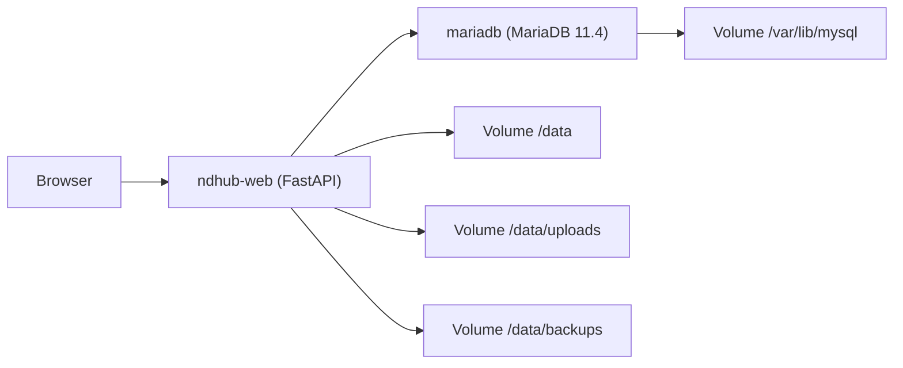
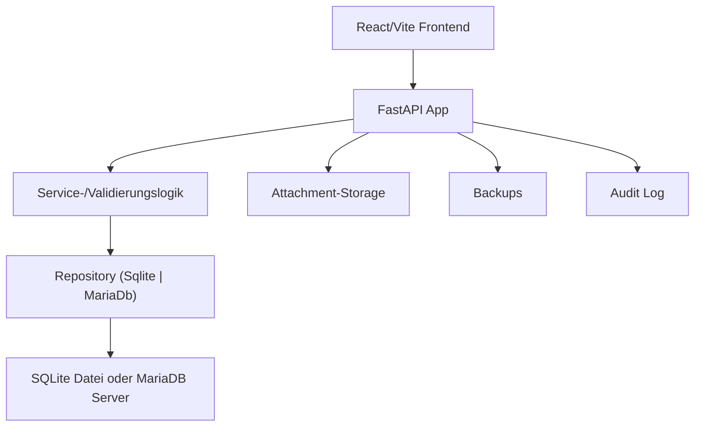

# Webanwendung: Ueberblick

## Steckbrief

| Eigenschaft | Wert |
|---|---|
| Backend | FastAPI + uvicorn (Python 3.12 im Container) |
| Frontend | Vite 5 + React 18 + TypeScript, Leaflet fuer Karten |
| Datenbank | SQLite oder MariaDB 11.4 |
| Auslieferung | Docker Compose (Multi-Service) |
| Sicherheit | Token-basiert, Audit-Logging, gehaertete Admin-Funktionen |

## Topologie



## Schnellstart (lokal)

```bash
cd ndhub-web/frontend-react && npm install && npm run build
cd ../.. && cd ndhub-web && python -m venv .venv && . .venv/bin/activate
pip install -r requirements.txt
python run_backend.py
```

Oder direkt ueber Docker (siehe
[Deployment / Docker-Stack](../deployment/01-docker-stack.md)).

## Beziehung zum Desktop Client

- Das Backend stellt die zentrale fachliche Wahrheit bereit.
- Der Desktop Client kann ueber `hybrid_sync` synchronisieren
  (Push/Pull, Konfliktregeln). Details:
  [Migration & Sync / Hybrid-Sync](../migration-and-sync/03-hybrid-sync.md).

## Schichten



## Bewusste Grenzen (aktuell)

- **Session-Store** ist in-memory; bei Prozessneustart sind aktive Tokens
  ungueltig. Fuer HA/horizontale Skalierung ist eine externe
  Session-Strategie noetig.
- **Sync v1** synchronisiert keine binaeren Attachment-Dateien.
- **SMTP-Liveversand** ist optional und ueber Environment konfigurierbar.

Detaillierte Liste siehe [Quality / Acceptance-Suite](../quality/02-acceptance-suite.md).
