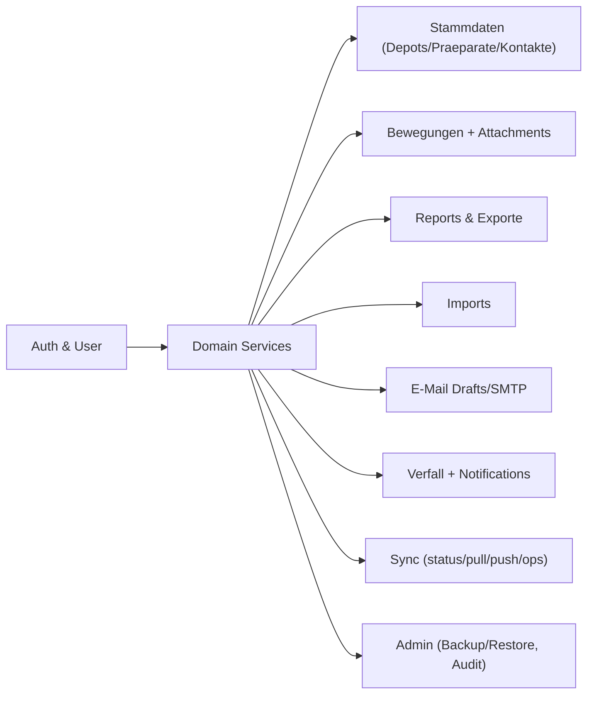

# Webanwendung: Backend

Das Backend ist eine FastAPI-Anwendung, die alle fachlichen Endpunkte
und Plattformfunktionen bereitstellt.

## Stack

| Komponente | Version |
|---|---|
| Python | 3.12 (im Container) |
| FastAPI | >= 0.116 |
| uvicorn | >= 0.35 |
| pandas | >= 2.2 |
| openpyxl | >= 3.1 |
| reportlab | >= 4.2 |
| python-pptx | >= 1.0 |
| bcrypt | >= 4.1 |
| PyMySQL | >= 1.1 |

Vollstaendige Liste: `ndhub-web/requirements.txt`.

## Start

```bash
cd ndhub-web
python -m venv .venv && . .venv/bin/activate
pip install -r requirements.txt
python run_backend.py
```

Standardwerte:

- Host: `127.0.0.1` (`ND_HUB_BACKEND_HOST`)
- Port: `8000` (`ND_HUB_BACKEND_PORT`)

Oder containerisiert via [Deployment / Docker-Stack](../deployment/01-docker-stack.md).

## Modulueberblick

| Modul | Zweck |
|---|---|
| `backend/app.py` | Routen, Lifecycle, Auth-Wiring, Reports/Exports. |
| `backend/auth.py` | Token-Store, Login/Refresh, Permissions. |
| `backend/database.py` | `SqliteRepository`, Schemaverwaltung. |
| `backend/mariadb_repository.py` | `MariaDbRepository` mit optionalem Dual-Write. |
| `backend/config.py` | Resolver fuer Engine, Pfade, SMTP. |
| `backend/security_manager.py` | Passwortpolitik, Account-Sperre. |
| `backend/tools/migrate_sqlite_to_mariadb.py` | Migration SQLite -> MariaDB. |
| `backend/web/*` | Legacy Web-MVP-Frontend (statisch). |

## Engine-Switch

```bash
ND_HUB_DB_ENGINE=sqlite      # lokaler Modus
ND_HUB_DB_ENGINE=mariadb     # Containerstandard, produktionsnah
ND_HUB_DUAL_WRITE_SQLITE=0   # Mirror-Mode aus (default fuer Go-Live)
```

Details: [Migration & Sync](../migration-and-sync/01-sqlite-vs-mariadb.md).

## Hauptverantwortlichkeiten

- **Validierung** von Eingaben (Datum ISO, Bewegungstypen, Filter,
  Pagination).
- **Audit-Logging** fuer relevante Mutationen.
- **Idempotenz** fuer Sync-Push (`batch_id`) und Imports (`fingerprint`).
- **Sicherheit** ueber Bearer-Tokens, Permissions und gehaertete
  Admin-Selbstschutzregeln.

## Schnittstellen-Kategorien



Vollstaendige Endpunkt-Referenz: [API Reference](../api-reference/01-rest-endpoints.md).
